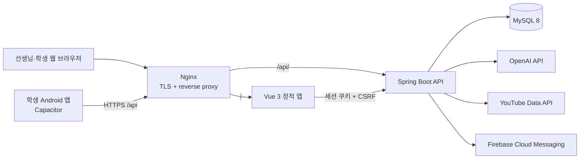
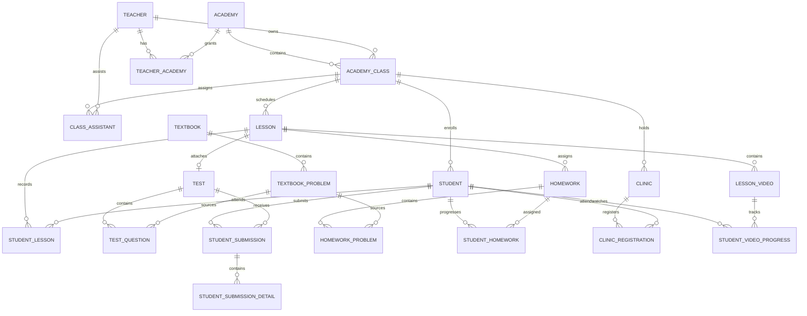
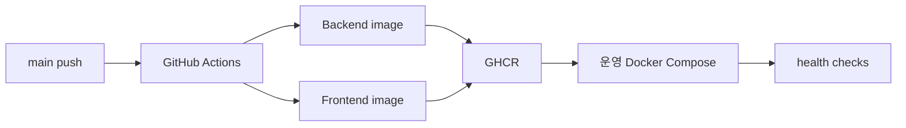

# Kim Math 프로젝트 구조

이 문서는 `main` 브랜치의 `4049c9f` 커밋을 기준으로 Kim Math의 목적, 구성, 핵심 도메인 흐름과 변경 시 주의할 경계를 설명합니다. 세부 API 계약은 컨트롤러와 `frontend/src/api/client.ts`를 최종 기준으로 삼습니다.

## 1. 시스템의 목적과 사용자

Kim Math는 학원의 수업 운영과 학생 학습 결과를 연결하는 웹·모바일 시스템입니다.

| 사용자 | 주요 작업 |
| --- | --- |
| 학원 관리자 | 선생님 초대와 역할 관리, 반 담당자·보조 선생님 배정, 학원 전체 데이터 조회 |
| 선생님 | 담당 반의 학생·수업·시험·숙제·출결·피드백·클리닉·영상 관리 |
| 보조 선생님 | 배정된 반을 일반 선생님 권한으로 지원하되 일부 관리성 변경 제한 |
| 학생 | 시험 응시와 결과 확인, 피드백·숙제·클리닉·학습 영상 확인 |
| 보호자 | 토큰 링크를 통한 학생 개인정보 수집·이용 동의 |

핵심 집계 단위는 `Academy`와 `AcademyClass`입니다. 대부분의 교사용 데이터는 현재 세션의 활성 학원과 담당 반 범위로 제한됩니다.

## 2. 실행 아키텍처



로컬에서는 Vite가 `5173`, Spring Boot가 `8080`, MySQL이 `3306` 포트를 사용합니다. 운영에서는 Nginx가 단일 HTTPS 진입점이 되고 프론트엔드와 API를 내부 컨테이너로 전달합니다.

## 3. 코드 구성

### 백엔드

백엔드는 전형적인 컨트롤러–서비스–리포지토리 구조입니다.

```text
src/main/java/com/example/
├── config/       # JPA 감사, 외부 API, FCM, Spring Security, 테넌트 필터
├── controller/   # /api HTTP 엔드포인트
├── dto/          # 요청·응답 모델
├── entity/       # JPA 엔티티와 Hibernate 필터 정의
├── exception/    # 전역 예외 응답
├── repository/   # Spring Data JPA 저장소
└── service/      # 트랜잭션, 권한 검증, 도메인 규칙, 외부 연동
```

주요 서비스 경계는 다음과 같습니다.

| 영역 | 주요 클래스 | 책임 |
| --- | --- | --- |
| 인증·권한 | `AuthSessionService`, `RememberMeService`, `AuthorizationService`, `MembershipService` | 로그인 세션, 자동 로그인, 활성 학원, 자원 접근 검증 |
| 학생·반 | `StudentService`, `StudentBulkService`, `AcademyService`, `AcademyClassService` | 학원 구조와 학생 생명주기 |
| 수업 | `LessonService`, `DailyFeedbackService` | 수업 생성, 시험·숙제 연결, 출결, 공지와 학생별 피드백 |
| 시험 | `TestService`, `SubmissionService` | 문항, 답안 제출, 자동·수동 채점, 통계 |
| 숙제·교재 | `HomeworkService`, `StudentHomeworkService`, `TextbookService`, `TextbookProblemService` | 문항 재사용, 학생별 오답·미풀이·질문·후속 관리 |
| 클리닉 | `ClinicService` | 보충 수업 등록, 출결, 숙제 진행과 최근 결과 |
| 영상 | `LessonVideoService`, `StudentVideoProgressService`, `YouTubeService` | YouTube 메타데이터와 시청 진도 |
| AI·알림 | `AiFeedbackService`, `BulkAiFeedbackProcessor`, `PushNotificationService` | 피드백 초안 생성, 비동기 일괄 처리, FCM 발송 |

### 프론트엔드와 Android

`frontend/src/router/index.ts`가 교사용·학생용 화면의 진입 권한을 나눕니다. `stores/auth.ts`는 현재 로그인 사용자, 학원 멤버십과 활성 학원을 관리하며, `api/client.ts`가 타입과 모든 API 호출을 한곳에 모읍니다.

Vue 앱은 같은 코드베이스에서 두 형태로 배포됩니다.

- 웹: Vite 빌드 결과를 Nginx가 제공
- Android: Capacitor WebView가 학생 화면, 생체 인증, 기기 자격 증명과 푸시 플러그인을 사용

네이티브 앱에서는 교사용 라우트를 차단합니다. 개발 기기의 `localhost:8080` 연결은 `adb reverse`를 사용하고, 운영 Android 빌드는 `.env.android`의 절대 API URL을 사용합니다.

## 4. 핵심 도메인 모델

다음 그림은 자주 변경되는 필드를 생략한 관계 중심 모델입니다.



### 중요한 불변 조건

- 반은 한 학원에 속하고 담당 선생님 `ownerTeacherId`를 가집니다.
- 선생님의 학원 접근은 `TeacherAcademy` 멤버십과 역할이 있어야 합니다.
- 시험과 숙제는 학원·반 범위 안에서 수업에 연결됩니다.
- 한 날짜에 같은 반의 수업은 하나만 존재하도록 제약합니다.
- 학생 답안은 학생–시험 조합의 제출과 문항별 상세 결과로 나뉩니다.
- 교재 문항은 시험 문항과 숙제 문항의 원본으로 연결될 수 있습니다.
- 학생의 PIN, 선생님의 PIN과 자동 로그인 토큰은 평문으로 저장하지 않습니다.

## 5. 주요 업무 흐름

### 학생 등록과 동의

1. 선생님이 학생을 개별 또는 일괄 등록합니다.
2. 학생은 `PENDING_CONSENT` 상태와 동의 토큰을 가집니다.
3. 보호자가 공개 동의 URL에서 정보를 확인하고 동의합니다.
4. 동의가 완료되면 학생 계정을 사용할 수 있습니다.

### 수업 운영

1. 학원과 반, 날짜로 수업을 만들거나 기존 수업을 조회합니다.
2. 시험 하나와 숙제 여러 개를 수업에 연결합니다.
3. 학생별 숙제를 배정하고 출결, 공지, 공통·개별 피드백을 기록합니다.
4. 필요하면 피드백이 작성된 학생에게 Android 푸시를 명시적으로 발송합니다.

### 시험과 채점

1. 선생님이 시험과 문항을 만들거나 교재 문항에서 가져옵니다.
2. 학생이 자신의 시험 답안을 제출하거나 선생님이 학생 대신 입력합니다.
3. 객관식·주관식은 저장된 정답으로 계산하고, 서술형은 교사가 점수와 코멘트를 확정합니다.
4. 점수, 반 평균, 순위, 문항별 통계와 미채점 서술형 수를 제공합니다.
5. `hideScoresFromStudent`가 켜진 학생에게는 학생용 결과 노출을 제한합니다.

### AI 피드백

1. 수업·학생·시험·숙제 결과를 피드백 문맥으로 구성합니다.
2. 선생님별 프롬프트 템플릿과 선택 모델로 OpenAI API를 호출합니다.
3. 단건 또는 비동기 일괄 생성 결과를 선생님이 검토·저장합니다.

AI 결과는 교사의 최종 검토가 필요한 초안입니다. 학생 개인정보가 외부 API로 전달될 수 있으므로 동의와 개인정보 처리방침을 함께 관리해야 합니다.

## 6. 인증, 권한과 테넌트 격리

### 인증 흐름

- 학생: 학생 ID와 PIN
- 선생님: 사용자명과 PIN
- 성공 시 서버 세션에 `userId`, `userRole`, `userName`을 저장
- 선생님은 멤버십 중 활성 학원을 선택하고 `activeAcademyId`, `activeRole`을 세션에 저장
- 자동 로그인은 별도 회전 토큰으로 세션을 복원
- 브라우저 변경 요청은 `/api/auth/csrf`에서 받은 토큰을 헤더에 포함

로그인 실패는 누적되며 잠금 정책이 적용됩니다. PIN은 BCrypt로 해시되고 운영 쿠키는 `Secure`, `HttpOnly`, `SameSite=Strict` 설정을 사용합니다.

### 역할 경계

| 역할 | 범위 |
| --- | --- |
| `ACADEMY_ADMIN` | 활성 학원의 모든 반과 교사 관리 API |
| `TEACHER` | 자신이 담당하는 반과 그 하위 데이터 |
| `ASSISTANT` | 보조로 배정된 반과 그 하위 데이터, 일부 관리 변경 제외 |
| `STUDENT` | 로그인한 학생 자신의 학습 데이터 |

`ACADEMY_ADMIN`과 `ASSISTANT`는 Spring Security 역할 계층에서 교사용 엔드포인트를 통과합니다. 실제 데이터 범위와 금지 작업은 Hibernate 필터와 `AuthorizationService`가 추가로 제한합니다.

### 변경 시 반드시 지킬 점

1. 목록 쿼리는 트랜잭션 안에서 `academyFilter`와 `ownerFilter`가 적용되는지 확인합니다.
2. `findById`는 Hibernate 필터를 우회할 수 있으므로 반드시 서비스에서 학원·반·학생 소유권을 검증합니다.
3. `@Async`와 스케줄러에는 요청의 `TenantContext`가 전달되지 않으므로 대상 ID를 안전한 동기 경로에서 확정하거나 별도 검증합니다.
4. `spring.jpa.open-in-view`를 끄면 현재 필터 활성화 방식이 깨지며 애플리케이션 시작 검사도 실패합니다.
5. 컨트롤러의 `@PreAuthorize`만으로 테넌트 격리가 완료됐다고 가정하지 않습니다.

## 7. API 영역

모든 보호 API는 `/api` 아래에 있고 공개 엔드포인트는 로그인, CSRF 토큰과 보호자 동의로 제한됩니다.

| 경로 영역 | 기능 |
| --- | --- |
| `/api/auth` | CSRF, 학생·선생님 로그인, 학원 전환, 로그아웃, 현재 사용자, PIN 변경 |
| `/api/academies`, `/api/classes` | 학원과 반 |
| `/api/admin` | 선생님 멤버십·역할, 반 담당자와 보조 선생님 |
| `/api/students`, `/api/consents` | 학생 관리, 일괄 등록, 보호자 동의 |
| `/api/lessons`, `/api/daily-feedback` | 수업, 출결, 공지, 배정, 피드백과 알림 |
| `/api/tests`, `/api/submissions` | 시험·문항·답안·채점·통계 |
| `/api/homeworks`, `/api/student-homeworks` | 숙제와 학생별 진행 |
| `/api/textbooks`, `/api/textbook-problems` | 교재와 재사용 문항 |
| `/api/clinics` | 클리닉 운영 |
| `/api/lessons/{id}/videos`, `/api/students/{id}/videos` | 영상과 시청 진도 |
| `/api/ai-feedback` | AI 피드백 단건·일괄 생성 |
| `/api/devices` | 학생 앱 푸시 토큰 등록·해제 |

API를 추가할 때 백엔드 DTO와 `frontend/src/api/client.ts` 타입을 함께 갱신하고, 교사·학생·관리자별 성공 및 거부 테스트를 작성합니다.

## 8. 설정과 외부 연동

### 데이터베이스 프로필

| 프로필 | 설정 | 용도 |
| --- | --- | --- |
| `local` | MySQL, `ddl-auto: create-drop`, SQL 로그와 샘플 데이터 | 휘발성 로컬 개발 |
| `test` | 인메모리 H2 MySQL 호환 모드, `create-drop` | 자동 테스트 |
| `prod` | MySQL SSL, `ddl-auto: validate`, SQL 로그 비활성 | 운영 |

운영 스키마는 자동 변경되지 않습니다. `migrations/README.md`의 순서와 검증 쿼리를 따라 SQL을 수동 적용합니다. 파일 이름이 혼재하더라도 현재 프로젝트에는 Flyway 의존성이나 자동 실행 설정이 없습니다.

### 외부 서비스

| 서비스 | 설정 | 실패 영향 |
| --- | --- | --- |
| OpenAI | `OPENAI_API_KEY`, 모델·토큰 설정 | AI 피드백 생성 실패, 나머지 기능은 사용 가능 |
| YouTube Data API | `YOUTUBE_API_KEY` | 새 영상의 메타데이터 등록 실패 |
| Firebase FCM | `PUSH_ENABLED=true`, 서비스 계정 | 비활성 시 로그만 남기며 앱은 정상 부팅 |

## 9. 테스트 전략

백엔드에는 인증·CSRF·자동 로그인·역할 격리, 학생 동의, 교재 문항, 숙제 배정, 답안 제출과 성적 공개에 대한 통합 테스트가 있습니다. 프론트엔드는 파서, 단원 집계, 문항 번호와 시험 타이머 같은 순수 로직을 Vitest로 검증합니다.

변경 전후 기본 검증 명령은 다음과 같습니다.

```bash
./gradlew test
cd frontend
npm test
npm run build:check
```

권한이나 데이터 모델 변경은 H2 테스트만으로 끝내지 말고 MySQL에서 마이그레이션 적용·롤백과 테넌트 누출 여부를 확인해야 합니다. Android 네이티브 기능은 실기기 또는 에뮬레이터 검증이 별도로 필요합니다.

## 10. 배포와 운영

`main` 푸시 시 GitHub Actions는 두 이미지를 빌드해 GHCR에 게시하고, 운영 서버에 SSH로 접속해 최신 Compose 구성을 적용합니다.



운영 변경 순서는 일반적으로 데이터베이스 백업, 사전 호환 DDL, 이미지 배포, 애플리케이션 검증, 후속 제약 강화 순입니다. 배포 전에 다음 문서를 함께 확인합니다.

- `DEPLOYMENT.md`: 서버 구축과 운영 절차
- `CICD_SETUP.md`: GitHub Actions secrets와 자동 배포
- `DEPLOYMENT_CHECKLIST.md`: 배포 전후 점검
- `migrations/README.md`: 수동 DDL 적용과 검증
- `docs/ANDROID_PUSH_GUIDE.md`: Android·FCM 운영
- `docs/YOUTUBE_API_SETUP.md`: YouTube API 키 설정

## 11. 변경 작업 체크리스트

- [ ] 변경 대상이 학원, 반 또는 학생 범위 중 어디에 속하는지 정의했다.
- [ ] 서비스 계층에서 기본 키 조회의 소유권을 검증한다.
- [ ] 관리자, 담당 교사, 보조 교사, 다른 학원 교사, 학생의 접근 결과를 확인한다.
- [ ] 엔티티 변경에 순방향 SQL, 필요 시 롤백 SQL과 검증 쿼리를 추가했다.
- [ ] 프론트엔드 API 타입과 화면의 권한 가드를 함께 갱신했다.
- [ ] 백엔드 테스트, 프론트엔드 테스트와 타입 검사를 통과했다.
- [ ] 외부 API 실패 시 핵심 학원 업무가 가능한지 확인했다.
- [ ] 개인정보, 로그, 푸시 토큰과 비밀값이 노출되지 않는지 확인했다.
